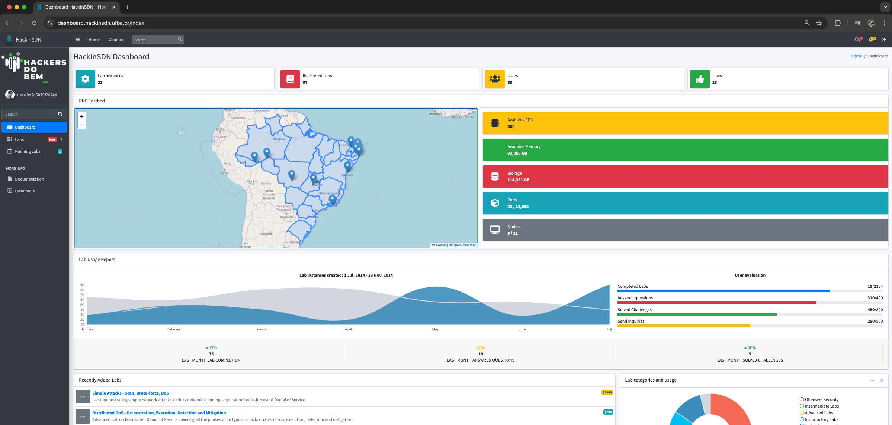
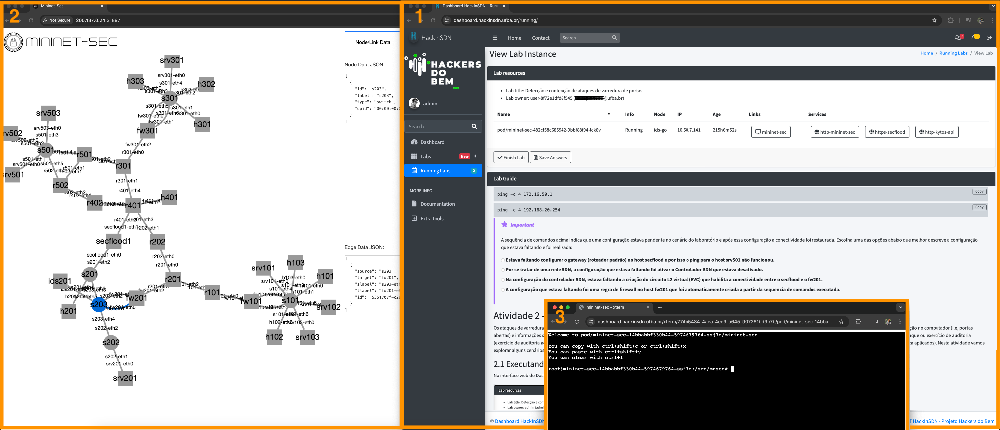

# Welcome to HackInSDN Dashboard!

Dashboard HackInSDN: a web platform for experimentation on cybersecurity and networking using Kubernetes clusters

- [Getting started](#getting-started)
- [Documentation](#documentation)
- [Context and Motivation](#context-and-motivation)
- [Architecture and main features](#architecture-and-main-features)
- [Screenshots](#screenshots)
- [License](#license)

## Getting started

See [installation instructions](./doc/INSTALL.md) and [Getting started / usage](./doc/GETTING_STARTED.md).

## Documentation

See [User documentation](./doc/GETTING_STARTED.md) and [Developer guidelines](./doc/DEV.md)

## Context and Motivation

One way to address the quantity and complexity of cybersecurity incidents,
which impact technological resources and sectors of society, is to invest
in user awareness and advanced training for professionals with practical
exercises and laboratories. Tools that simplify access to experimental 
environments with specialized networking and cybersecurity resources 
are essential in this context.

This repo contains the HackInSDN Dashboard, a web platform that facilitates 
experimentation in networking and cybersecurity by orchestrating testbed
resources. The Dashboard can be deployed to orchestrate resources from a 
Kubernetes cluster, enabling its use in cloud commercial environments and 
scientific testbeds. There is a running instance of the Dashboard integrated
with the Brazilian Research and Education Network (RNP) testbed: https://dashboard.hackinsdn.ufba.br

This tool has been used experimentally in undergraduate and graduate courses and 
proof-of-concept labs in the RNP's Hackers do Bem project.

## Architecture and main features

The Dashboard HackInSDN architecture is showed below:

The main components of the Dashboard are:

- Authentication and Authorization module (Authn/AuthZ): responsible for authenticating users via local database or Oauth2 federated authentication. This module also provides authorization, allowing different user profiles: non-privileged users, students, teachers, administrators.

- User and Group Control: this module allows fine-grained access control via Group membership capabilities.

- Statistics: provide general information about the Kubernetes cluster and statistics

- Laboratory Management: provide all the main features related to Lab management (overall lab life cycle, lab guides, questions and answers)

## Screenshots

Initial/home page with statistics and resources available on the Kubernetes cluster:

View Labs page:

Lab instance page, including Mininet-sec service opened (left hand side) and Lab guide / Lab resources (right hand side), and an example of console opened for one of the containers (bottom of the image):

Create Lab page:

### Help and Support  

Found a bug or need help? Report it here!  
To contact the development team, email hackinsdn@ufba.br.

## License

This software is under _MIT-License_. For more information please read `LICENSE` file.
