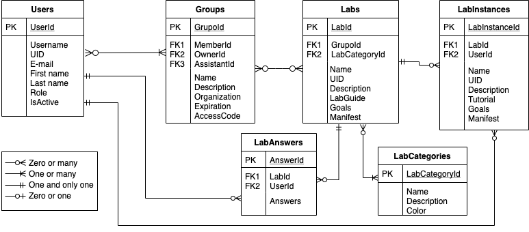

# Developer guidelines

This page contains some documentation for developers.

## Entity Relationship Diagram

The picture below shows the Entity Relationship Diagram for Dashboard HackInSDN:



In terms of modeling for laboratories, it is possible to observe the Laboratory (Lab) and Lab Instance entities. A lab can have multiple execution instances, but each instance can be associated with a user and a lab. In addition, a user can only execute one instance of the same lab at a time, and multiple instances are allowed as long as they are from different labs.

Each lab has information about the associated execution guides, also known as lab scripts or tutorials, which describe the steps that the student must follow to carry out the complete experiment and achieve the objectives established for that laboratory in question. The lab creator can also define lab restrictions such as: maximum amount of CPU allocated, maximum amount of memory, maximum amount of time, maximum number of Pods, images that can be used in each Pod, nodes on which the instances will be created, among others.

## File structure

Below you can find more information about how the files are organized on this repo:

```
.
├── Dockerfile
├── LICENSE
├── README.md
├── apps: main source code folder
│   ├── __init__.py
│   ├── api: routes for REST API
│   │   ├── __init__.py
│   │   └── routes.py
│   ├── audit_mixin.py: helper functions for auditing
│   ├── authentication: Authentication module
│   │   ├── __init__.py
│   │   ├── forms.py
│   │   ├── models.py
│   │   ├── routes.py
│   │   └── util.py
│   ├── config.py: configuration file
│   ├── controllers: controllers handlers to orchestrate resources
│   │   ├── __init__.py
│   │   └── kubernetes.py
│   ├── events.py: mainly used for console interactions (via SocketIO)
│   ├── home: main features of the portal, include user management, lab orchestration, groups, etc.
│   │   ├── __init__.py
│   │   ├── models.py
│   │   └── routes.py
│   ├── static: static files such as javascript libs, css, images, fonts, etc.
│   └── templates
│       ├── includes: template files to be included on other pages
│       ├── layouts: different HTML layouts to display the pages
│       └── pages: pages template using Jinja2 language
├── dbinit.py
├── doc: project documentation
├── docker-entrypoint.sh
├── env-template
├── requirements.txt
├── run.py
└── scripts
    ├── notify_users_pending_approval.py
    └── run-flask.sh
```

## Modules and classes

Below you can find a overall description of each module and class that compose Dashboard HackInSDN:

### apps.authentication

On the authentication module you will basically find everything that is related to authentication: models and controllers.

The module `apps.authentication.models` defines the following classes:

- `Users`: main user class and its attributes such as username, e-mail, ID (number), UID (string), etc.
- `Groups`: main group class stores information about user groups and their associated privileges. The owner has full control, the assistant has elevated but limited privileges, and the member can participate and access resources.
- `UserGroups`: class to keep track of group membership
- `LoginLogging`: used mainly for auditing and logging purposes

The module `apps.authentication.routes` defines the application routes when navigating and clicking on the links:

- `GET /`: view the home page with statistics and information about the Kubernetes cluster
- `GET /login` and `POST /login`: visualization of the login form and submit handler for login attempts
- `GET /login/oauth`: login handler for federated authentication via Oauth2
- `GET /login/callback` and `POST /login/callback`: callback page for federated authentication via Oauth2 (after successful login on the Oauth provider, this page will be called back)
- `GET /register` and `POST /register`: register new users
- `GET /confirm` and `POST /confirm`: confirm user registration
- `GET /resend-code`: re-send validation tokens for user registration
- `GET /logout`: logout the user
- errorhandlers for 403, 404, 500: error handler pages for failures

### apps.home

The `home` module is responsible for the main features of the Dashboard: lab orchestration, group membership, etc.

The module `apps.home.models` has the following classes:

- class LabCategories: categories used by the labs
- class Labs: main laboratory class with its attributes
- class LabInstances: lab instance class with information about the Lab and the user running it
- class LabAnswers: for each Lab, the Lab creator can define questions and this class keeps track of the answers provided by users per Lab
- class HomeLogging: mainly used to logging actions of the features

The module `apps.home.routes` defines the application routes when navigating and clicking on the links:

GET /index: Displays the home page with statistics and information about the Kubernetes cluster.
GET /running: Displays the list of running labs for the authenticated user, with options to filter by group.
GET /run_lab: Displays the form to start a specific lab (GET) or processes the request to start the lab (POST).
GET /lab_status: Checks the status of a specific running lab.
GET /xterm/: Displays an interactive terminal (xterm) for a specific container within a lab pod.
GET /users and GET /profile: Displays and processes the form to edit user information (profile).
GET /lab_instance/view: Displays details of a running lab instance.
GET /labs/edit: Displays and processes the form to edit information for a specific lab.
GET /users: Displays the list of registered users.
GET /labs/view and GET /labs/view: Displays the list of available labs or details of a specific lab.
GET /groups/list: Displays the list of user groups.
GET /groups/edit: Displays and processes the form to edit user group information.
GET /lab_answers/list: Displays the list of lab answers submitted by users.
GET /lab_answers/answer_sheet/: Displays and processes the form to add or edit a lab's answer sheet.
GET /gallery: Displays an image gallery page.
GET /documentation: Displays the application's documentation.
GET /contact: Displays the contact page.
