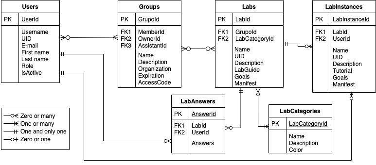

# Developer guidelines

This page contains some documentation for developers.

## Tests + Linter + Format

```
python3 -m venv .venv
source .venv/bin/activate
python3 -m pip install -r requirements-dev.txt
pytest -v tests/
djlint --profile=jinja2 --ignore=H023,D004,J004 apps/templates/
black --check apps/
```

## Entity Relationship Diagram

The picture below shows the Entity Relationship Diagram for Dashboard HackInSDN:



In terms of modeling for laboratories, it is possible to observe the Laboratory (Lab) and Lab Instance entities. A lab can have multiple execution instances, but each instance can be associated with a user and a lab. In addition, a user can only execute one instance of the same lab at a time, and multiple instances are allowed as long as they are from different labs.

Each lab has information about the associated execution guides, also known as lab scripts or tutorials, which describe the steps that the student must follow to carry out the complete experiment and achieve the objectives established for that laboratory in question. The lab creator can also define lab restrictions such as: maximum amount of CPU allocated, maximum amount of memory, maximum amount of time, maximum number of Pods, images that can be used in each Pod, nodes on which the instances will be created, among others.

## File structure

Below you can find more information about how the files are organized on this repo:

```
.
├── Dockerfile
├── LICENSE
├── README.md
├── apps: main source code folder
│   ├── __init__.py
│   ├── api: routes for REST API
│   │   ├── __init__.py
│   │   └── routes.py
│   ├── audit_mixin.py: helper functions for auditing
│   ├── authentication: Authentication module
│   │   ├── __init__.py
│   │   ├── forms.py
│   │   ├── models.py
│   │   ├── routes.py
│   │   └── util.py
│   ├── config.py: configuration file
│   ├── controllers: controllers handlers to orchestrate resources
│   │   ├── __init__.py
│   │   └── kubernetes.py
│   ├── events.py: mainly used for console interactions (via SocketIO)
│   ├── home: main features of the portal, include user management, lab orchestration, groups, etc.
│   │   ├── __init__.py
│   │   ├── models.py
│   │   └── routes.py
│   ├── static: static files such as javascript libs, css, images, fonts, etc.
│   └── templates
│       ├── includes: template files to be included on other pages
│       ├── layouts: different HTML layouts to display the pages
│       └── pages: pages template using Jinja2 language
├── dbinit.py
├── doc: project documentation
├── docker-entrypoint.sh
├── env-template
├── requirements.txt
├── run.py
└── scripts
    ├── notify_users_pending_approval.py
    └── run-flask.sh
```

## Modules and classes

Below you can find a overall description of each module and class that compose Dashboard HackInSDN:

### apps.authentication

On the authentication module you will basically find everything that is related to authentication: models and controllers.

The module `apps.authentication.models` defines the following classes:

- `Users`: main user class and its attributes such as username, e-mail, ID (number), UID (string), etc.
- `Groups`: main group class stores information about user groups and their associated privileges. The owner has full control, the assistant has elevated but limited privileges, and the member can participate and access resources.
- `UserGroups`: class to keep track of group membership
- `LoginLogging`: used mainly for auditing and logging purposes

The module `apps.authentication.routes` defines the application routes when navigating and clicking on the links:

- `GET /`: view the home page with statistics and information about the Kubernetes cluster
- `GET /login` and `POST /login`: visualization of the login form and submit handler for login attempts
- `GET /login/oauth`: login handler for federated authentication via Oauth2
- `GET /login/callback` and `POST /login/callback`: callback page for federated authentication via Oauth2 (after successful login on the Oauth provider, this page will be called back)
- `GET /register` and `POST /register`: register new users
- `GET /confirm` and `POST /confirm`: confirm user registration
- `GET /resend-code`: re-send validation tokens for user registration
- `GET /logout`: logout the user
- errorhandlers for 403, 404, 500: error handler pages for failures

### apps.home

The `home` module is responsible for the main features of the Dashboard: lab orchestration, group membership, etc.

The module `apps.home.models` has the following classes:

- class LabCategories: categories used by the labs
- class Labs: main laboratory class with its attributes
- class LabInstances: lab instance class with information about the Lab and the user running it
- class LabAnswers: for each Lab, the Lab creator can define questions and this class keeps track of the answers provided by users per Lab
- class HomeLogging: mainly used to logging actions of the features

The module `apps.home.routes` defines the application routes when navigating and clicking on the links:

- `GET /index: Displays the home page with statistics and information about the Kubernetes cluster.`
- `GET /running: Displays the list of running labs for the authenticated user, with options to filter by group.`
- `GET /run_lab: Displays the form to start a specific lab (GET) or processes the request to start the lab (POST).`
- `GET /lab_status: Checks the status of a specific running lab.`
- `GET /xterm/: Displays an interactive terminal (xterm) for a specific container within a lab pod.`
- `GET /users and GET /profile: Displays and processes the form to edit user information (profile).`
- `GET /lab_instance/view: Displays details of a running lab instance.`
- `GET /labs/edit: Displays and processes the form to edit information for a specific lab.`
- `GET /users: Displays the list of registered users.`
- `GET /labs/view and GET /labs/view: Displays the list of available labs or details of a specific lab.`
- `GET /groups/list: Displays the list of user groups.`
- `GET /groups/edit: Displays and processes the form to edit user group information.`
- `GET /lab_answers/list: Displays the list of lab answers submitted by users.`
- `GET /lab_answers/answer_sheet/: Displays and processes the form to add or edit a lab's answer sheet.`
- `GET /gallery: Displays an image gallery page.`
- `GET /documentation: Displays the application's documentation.`
- `GET /contact: Displays the contact page.`

## apps.audit_mixin.py

The AuditMixin is a crucial component for maintaining auditability and traceability within the system. It ensures that any modifications to database records are automatically logged, providing a clear history of changes.

The mixin introduces three key fields that track record creation and updates:

- `created_at: Stores the timestamp when the record was first created.`
- `updated_at: Stores the timestamp of the most recent modification.`
- `updated_by: Logs the ID of the user who made the last update.`

The AuditMixin uses the `utcnow()` function to ensure that date and time records are made in UTC time, avoiding issues related to different time zones, especially in distributed systems or with users in different regions.

## Scheduled jobs (cron)

Some periodic tasks are implemented as Flask CLI commands under the `cli` group
(`apps/cli/routes.py`) and are meant to be triggered by an external scheduler
(e.g. cron or a Kubernetes CronJob). Invoke them with the same app entrypoint
used to run the server:

| Command | Purpose | Suggested schedule |
| --- | --- | --- |
| `flask --app run.py cli notify-expiring-labs --send-email` | E-mail users whose lab instances are about to expire | every 30 min |
| `flask --app run.py cli remove-expired-labs` | Delete lab instances past their expiration tolerance | every 10 min |
| `flask --app run.py cli flush-support-emails` | Send **batched** support-chat notifications to the support inbox | every 2–5 min |
| `flask --app run.py cli sync-pre-approved-users` | Backfill group memberships from the groups' pre-approved e-mail lists | on demand / daily |
| `flask --app run.py cli rag-ingest` | Build/refresh the RAG assistant's document corpus | hourly (when `RAG_ENABLED`) |
| `flask --app run.py cli rag-health` | Check the assistant service: connectivity, corpus, backends | on demand |

### `sync-pre-approved-users`

New users are joined to matching pre-approved groups automatically at
creation (a `Users` after-insert listener), but users that already existed
when an e-mail was added to a group's pre-approved list are not. This job
closes that gap: for every active user whose e-mail appears in a group's
pre-approved list, it adds the missing membership (never duplicating, never
touching SYSTEM groups or soft-deleted users). Options:

- `--dry-run` — print the would-be changes and roll back;
- `--promote` — also switch `category` from `user` to `student` for users
  that received a new membership (the same promotion their next login would
  perform via `check_pre_approved`).

Run it once after upgrading to this feature, then on demand (or daily) for
deployments that edit pre-approved lists frequently.

### `rag-ingest`

Collects the corpora listed in `RAG_INGEST_SOURCES` (repository docs, the
curated FAQ under `doc/faq/`, lab descriptions, and — opt-in — lab guides) and
pushes them to the `hisdn-rag` service. Documents carry a content hash, so an
unchanged document is skipped rather than re-embedded, and each source ends with
a prune manifest so deleted documents leave the index. Options:

- `--source repo-docs` — restrict to one corpus (repeatable);
- `--dry-run` — print what would be sent without contacting the service. This is
  also how you audit what the assistant knows;
- `--full` — re-embed everything, ignoring content hashes. Needed after changing
  the embedding model (the service detects that on its own too).

It is a no-op when `RAG_ENABLED` is off. See
[rag-assistant-design.md](./rag-assistant-design.md) and [../rag/README.md](../rag/README.md).

### `flush-support-emails`

The support chat (see [support-chat-design.md](./support-chat-design.md)) does **not**
e-mail the support team on every message. Instead, each user message is stored with
`emailed_at = NULL`, and this job groups a user's pending messages into a **single**
e-mail once the user has been quiet for at least `SUPPORT_EMAIL_BATCH_MINUTES`
(default `10`). Behaviour notes:

- It only sends when `MAIL_SENDTO` is configured; otherwise it is a no-op.
- For each thread, it waits until the newest un-e-mailed user message is older than
  the batch window, then sends one e-mail (including the thread telemetry: origin
  page, IP, browser) to `MAIL_SENDTO` and stamps those messages `emailed_at`.
- It is idempotent: already-e-mailed messages are never resent.

Run it at an interval shorter than `SUPPORT_EMAIL_BATCH_MINUTES` so notifications are
not delayed much beyond the quiet window, e.g. a crontab entry:

```
*/3 * * * * cd /opt/dashboard && flask --app run.py cli flush-support-emails >> /var/log/dashboard-support.log 2>&1
```

## TLS and reverse proxy

**Do not terminate TLS directly in gunicorn.** The shipped `docker-entrypoint.sh`
runs gunicorn as plain HTTP with `--proxy-allow-from "*"`, which assumes a
**reverse proxy (nginx / traefik / caddy) terminates TLS in front of it**. That is
the recommended deployment: the proxy handles the certificate and forwards plain
HTTP to gunicorn. Because `apps/audit_mixin.get_remote_addr()` reads
`request.access_route` (i.e. `X-Forwarded-For`), the real client IP — including the
support-chat telemetry — is preserved as long as the proxy sets the
`X-Forwarded-For` / `X-Forwarded-Proto` headers.

### Symptom: `SSLV3_ALERT_CERTIFICATE_UNKNOWN` in the logs

If you instead let gunicorn terminate TLS itself (e.g. passing `--certfile/--keyfile`
via `EXTRA_OPS`) with a **self-signed certificate**, you may see noisy tracebacks like:

```
ssl.SSLError: [SSL: SSLV3_ALERT_CERTIFICATE_UNKNOWN] sslv3 alert certificate unknown
  ... gevent/ssl.py ... do_handshake()
```

This is a **TLS handshake alert sent by the browser** to reject the untrusted
certificate — it happens in the gevent SSL layer *before* any request reaches Flask,
so it is unrelated to the application code (the accepted connections still return
`200`). It became more visible with the support chat because the widget and
thread-view pages poll every 30 s, and browsers open extra background/preconnect TLS
connections; those background sockets never get the interactive "accept the risk"
prompt, so they are silently aborted with `certificate unknown`.

Fixes:

- **Preferred:** terminate TLS at a reverse proxy and run gunicorn over plain HTTP
  (as above); gunicorn then never performs the TLS handshake and the errors disappear.
- **Local/dev:** make the certificate trusted instead of using a bare self-signed one
  — e.g. generate a locally-trusted cert with [`mkcert`](https://github.com/FiloSottile/mkcert),
  or import the self-signed cert into the OS/browser trust store (macOS Keychain →
  *Always Trust*). For a real hostname, use a CA-issued certificate (Let's Encrypt).
- If you keep gunicorn terminating self-signed TLS, the tracebacks are harmless log
  noise (functionality is unaffected); the trust fixes above are still the right move.
