# HackInSDN Dashboard - Usage

## Federated authentication and social login

The HackInSDN Dashboard supports federated authentication (i.e., allow access using a single login from user's organization) and social login (i.e, authentication using your social network credentials), both of them via CILogon identity and access management platform.

For admins: to enable federated authentication, please refer to [this configuration guide](./INSTALL.md#authentication).

For users: to use the federated login, you just need to choose it when authenticating in the system:

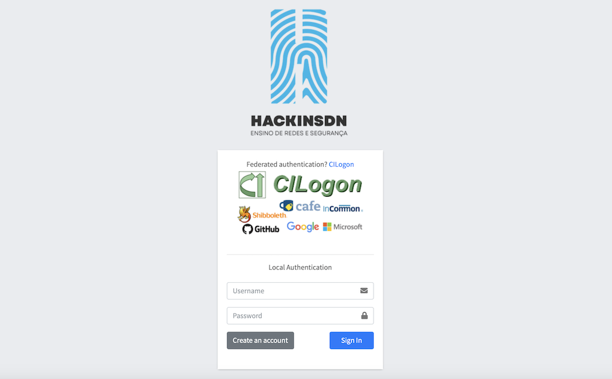

After clicking on the CILogon federated authentication link or the image, you will be redirected to CILogon page:

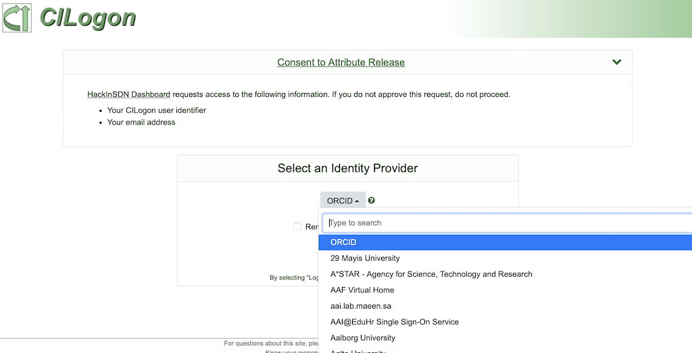

On the CILogon page, you can choose your organization or social network authentication provider:

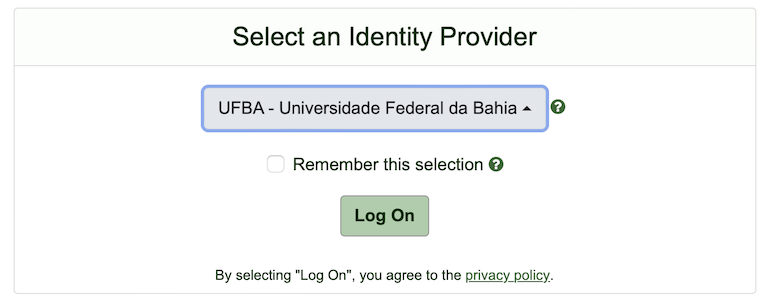

And then authenticate with your preferred identity provider, in the example below it was the University portal:

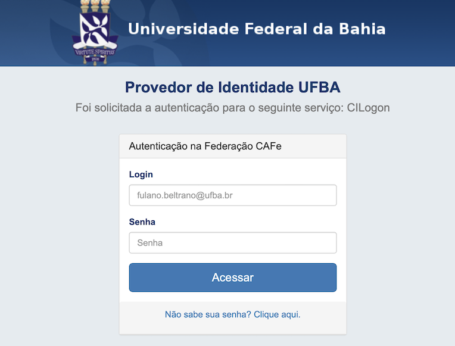

After login, you will be redirected back to the Dashboard portal where you will see an unauthorized login message, as displayed below:

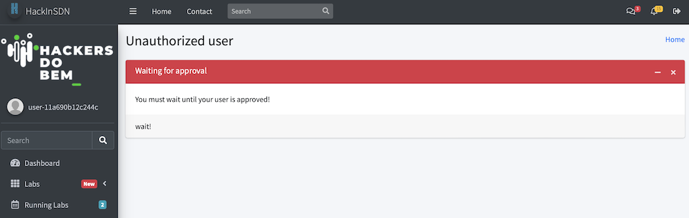

This message is shown because the first login of a new user will require authorization. Any "admin" or "teacher" users can approve the user. Furthermore, the user can be pre-approved when it is pre-configured as part of a group.

## Approving Users

Admin or Teacher users can approve a user, which will automatically change the provide or that user to be an student. Additionally, teachers and admins can add new users to a pre-approved list as part of a group configuration. That way, when the user first login, it will be automatically approved.

To manually approve an user, open the Users page:

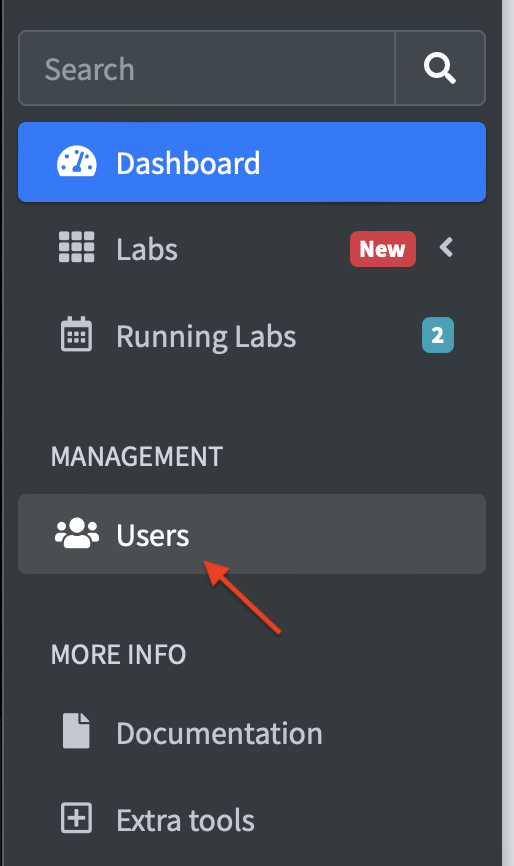

Then choose the list of users to approve (you can select multiple users simultaneously). Then click on approve:

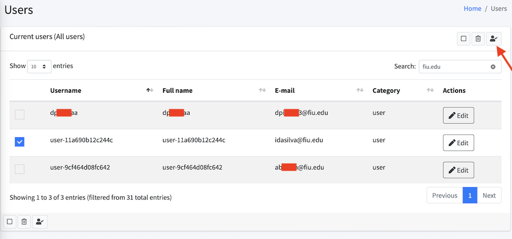

## Running Labs

To run Labs on Dashboard you just need to navigate over Labs > View Labs:

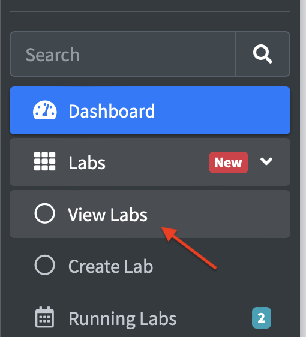

On the view labs page, you can filter the Lab by category. For example, by just clicking the "Advanced" category on the top of the page, you will see all the Labs which were added the category advanced:

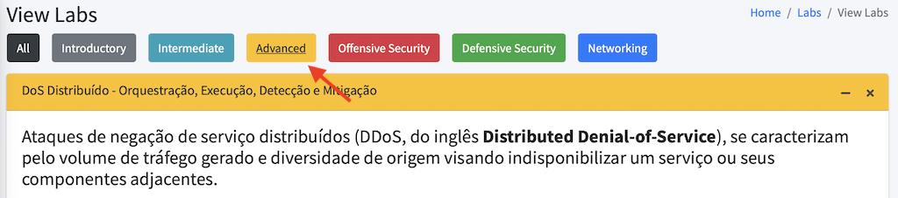

After navigating through the labs and choosing your Lab, you can view more information about the lab by clicking on "View Lab" button, or you can start the Lab by clicking the "Start Lab" button:

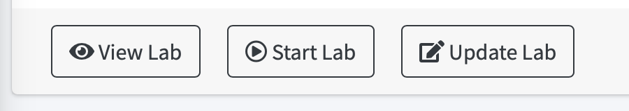

**Note:** an user can only run the same lab one time. If you already running a lab, the "Start Lab" button will become "Resume Lab". If you want to restart that lab, you need to first finish it (see below).

After clicking on "Start Lab", you will see a page showing general information about the Lab. You can leave all parameters with default values. You can also change, for instance, the scheduling values to specify when that Lab should be started/finished (the Lab can be extended later as many times as needed). When ready to start the lab, click "Run":

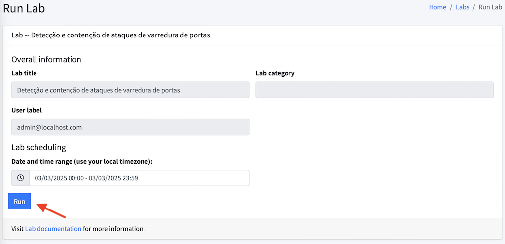

The next screen will show you the resource allocation and creation proccess in the Kubernetes cluster. This proccess can take a few seconds while resources are being instantiated (images downloaded, resources scheduled, resources created and made available). See an example of the resource creation screen below:

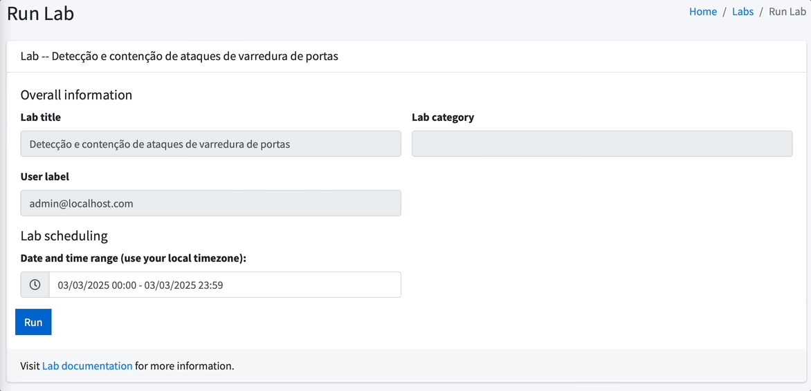

When resources are ready, you will see a green button "Start using the Lab resources and Lab guide!". Click on it.

The next screen will show you some information about the Lab and the Lab Guide (step by step documentation to guide you through the lab execution):

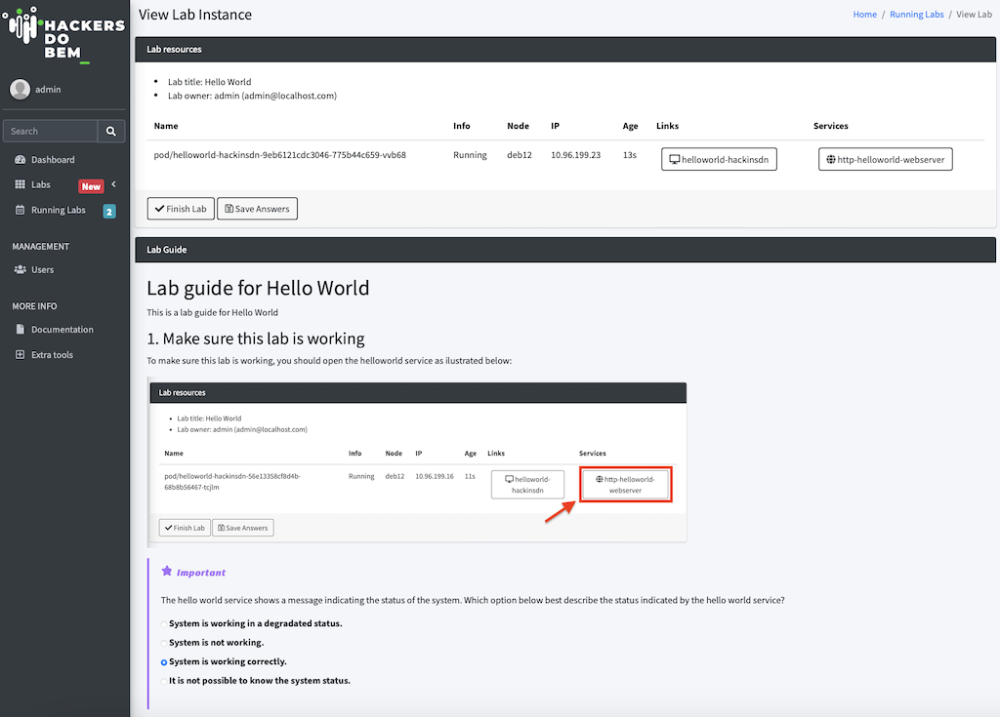

On the top of this page, you will see some general information about the Lab itself (Lab resources): resources available, lab title, user who instantiated the lab, status of the Pods, IP address and, more importantly, links to consoles and services.

On the footer of the Lab resources section, you will two buttons for Finishing the Lab and Saving Lab Answers. Finishing the Lab basically means that all resources allocated will be released so that other person can use them. If you define a lab expiration time, the lab will be automatically removed after expering (it can be extended as many times as needed). For the Lab Answers, throughout the Lab the author of the lab guide can include some questions so that he/she can measure students/experimenters engagement and learning progress. The Save Answers button will make sure your answers will be saved.

The other section on that page is the "Lab guide", which is basically a documentation provided by the Lab author to guide you throughout the lab execution: step-by-step instructions on how to use the Lab. Two features deserves mentioning on this section: a) the "copy" button which allows you to copy the commands provided on the guide to facilitate execution; b) Lab questions, also provided by Lab author to measure engagement and learning progress.

## Video on Creating Labs

## Video on Using Labs

## Dynamic Lab Templates Repository

The Dashboard uses an external Git repository to store all Kubernetes manifests (`.yaml` files) that serve as templates for creating new Labs.  
This approach ensures that the list of available templates is always synchronized with the source code, eliminating the need to restart the application every time a template is added or updated.

## Repository Synchronization Process

During the application's startup process, a dedicated function is executed to:

1. **Check the environment variables** (`LAB_TEMPLATES_GIT_REPO` and `GIT_PAT`).
2. **Clone the Git repository** to the path specified by `LAB_TEMPLATES_DIR` (inside the container).
3. **Update the repository** if it already exists (via `git pull`).

After loading, the **Lab editing interface** accesses this cloned directory to dynamically list and load the templates, ensuring the **Manifest editor** is always updated with the latest resources.

---

## Lab Templates Configuration (Git)

These variables are used by the application's initialization function to clone and keep the Kubernetes manifest repository (`.yaml` files) updated.  
This repository serves as the source for creating new Labs.

| Variable | Description | Example Value | Required |
|-----------|--------------|----------------|-----------|
| `LAB_TEMPLATES_GIT_REPO` | The URL of the Git repository containing the templates, excluding the `https://` protocol. | `github.com/user/lab-templates.git` | Yes |
| `GIT_PAT` | The Personal Access Token (PAT) for Git. Essential for accessing private repositories. | `ghp_your_pat_here_1234567890` | Yes (for Private Repos) |
| `LAB_TEMPLATES_DIR` | The absolute or relative path where the templates repository will be cloned inside the container. | `/app/apps/data/templates-test` | No (uses default value) |