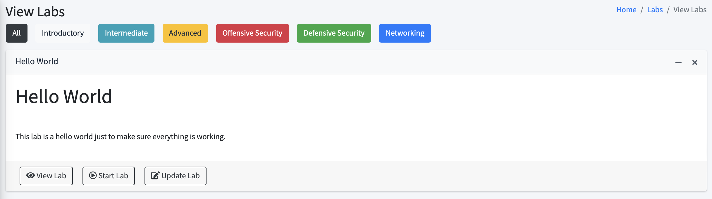
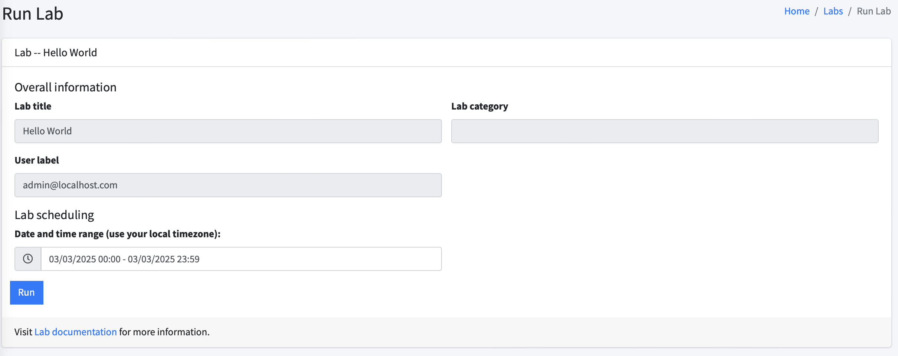
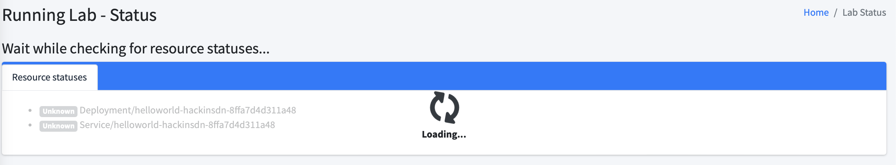
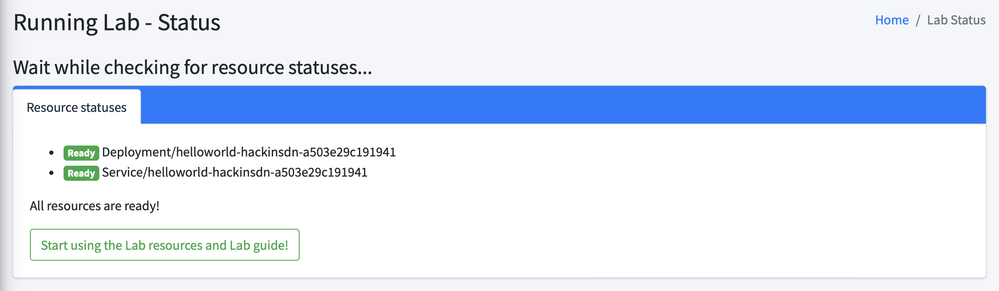
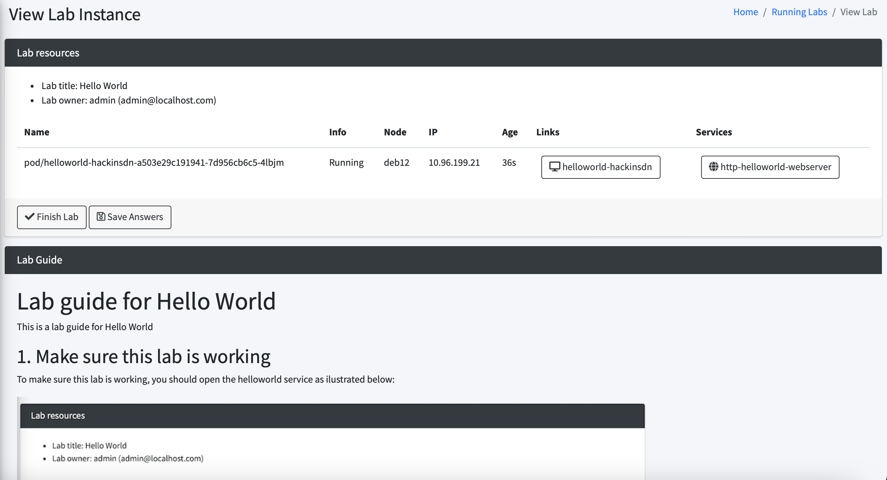

# Dashboard HackInSDN Install guide

This document describe the steps for installing Dashboard HackInSDN and integrate it with a Kubernetes cluster. The document is structured in the following way:

- [Pre-requirements](#pre-requirements)  
- [Running with Docker](#running-with-docker)
- [Installing step-by-step](#installation-step-by-step)
- [Running a hello world](#running-a-hello-world-lab)

## Pre-requirements

Two main pre requirements are necessary to run Dashboard with its main funcionality: 1) **Authentication** credentials with a Oauth2 provider; 2) **Kubernetes** credentials for a cluster that will provide the actual experimentation resources.

### Authentication

Dashboard HackInSDN supports *local authentication* and *federated authentication*. Local authentication is enabled by default when installing Dashboard HackInSDN and can also be used together with federated authentication. Federated authentication rely on a Oauth2 provider to actually interact with a Identify Provider and authenticate users. There are many Oauth2 authentication providers available for use, including: [CILogon](https://www.cilogon.org/oidc), [ORCID](https://info.orcid.org/documentation/api-tutorials/api-tutorial-get-and-authenticated-orcid-id/), [Auth0](https://auth0.com/), [Google Identify](https://developers.google.com/identity/protocols/oauth2), [Facebook/Meta Login](https://developers.facebook.com/docs/facebook-login/guides/advanced/manual-flow), and the list keeps growing.

CILogon and ORCID are two very interesting Oauth2 providers because they have integration with academic identity providers, enabling users to login with their organization accounts (students, professors, researches, faculty, etc). Choose one of them (or any other Oauth provider of your interest) and create the Application Credentials to integrate with Dashboard HackInSDN. Below are two links with documentation for CILogon and ORCID:

- [CILogon OpenID Connect (OIDC) Client Registration](https://cilogon.org/oauth2/register)

- [ORCID Registering a Public API client](https://info.orcid.org/documentation/integration-guide/registering-a-public-api-client/)

Once you have the client registration information, you will need the following information to configure Dashboard HackInSDN (those information dont actually need to be exported like showed below: you can configure them into the `apps/config.py` file or start the docker container with environment variables. We show below just for ilustrate the information needed):

```
# example for CILogon
export OAUTH_CLIENT_ID=cilogon:/client_id/xxxxyyyyzzzz
export OAUTH_CLIENT_SECRET=xxxyyzzwww-aaabbcc112233
export OAUTH_DOMAIN=cilogon.org

# example for ORCID
export OAUTH_CLIENT_ID=APP-xxxyyyzzz
export OAUTH_CLIENT_SECRET=xxx-yyy-zzz-www-aaaa
export OAUTH_DOMAIN=orcid.org
```

### Kubernetes

Dashboard HackInSDN is a web platform for running virtual laboratories based on a cloud service model. Thus, in order to actually run your experiments, you will need an execution environment. More specifically, you will need access to a Kubernetes cluster. [Kubernetes](https://kubernetes.io), also known as K8s, is an open source system for managing containerized applications across multiple hosts. It provides basic mechanisms for the deployment, maintenance, and scaling of applications. Although it may sound more complicated than it actually is, Kubernetes provides an abstraction layer to actually orchestrating experimentation resources (all the way from containers, CPU, memory up to programmable NICs, GPU, even external resources). You can [create a single-node Kubernetes cluster on your computer using a virtual machine](./install-k8s-vm.md) with very reasonable simple requirements like: virtual machine running a deb/rpm-compatible Linux OS, for example Ubuntu or CentOS; 2GB or more of RAM; at least 2 vCPUs; 20GB of disk space; and Internet access.

There are many Kubernetes clusters available for commercial and academic usage. Some commercial examples include:

- [DigitalOcean Kubernetes - DOKS](https://docs.digitalocean.com/products/kubernetes/)

- [Google Kubernetes Engine - GKE](https://cloud.google.com/kubernetes-engine)

- [Amazon Elastic Kubernetes Service - Amazon EKS](https://aws.amazon.com/eks/)

- [Microsoft Azure Kubernetes Service - AKS](https://azure.microsoft.com/es-es/products/kubernetes-service)

For academic/research usage, there are also many projects that offer experimentation resourecs via Kubernetes APIs:

- [Serviço de Testbed RNP - Cluster Nacional](https://ajuda.rnp.br/servico-de-testbeds)

- [MENTORED Testbed for DDoS & IoT & Flexibility](https://portal.mentored.ccsc-research.org)

- [NRP Kubernetes portal](https://portal.nrp-nautilus.io) 

## Running with Docker

To run Dashboard with Docker you can leverage the pre-build image available in https://hub.docker.com/r/hackinsdn/dashboard. The steps are described below:

1. Run the docker image:
```
docker run -d --name dashboard1 -p 8080:8080 -v $PWD/kube-config.yaml:/etc/kube-config.yaml -e INIT_SCRIPT=/app/dbinit.py -e DEBUG=True -e KUBECONFIG=/etc/kube-config.yaml -e K8S_NAMESPACE=hackinsdn -e BASE_URL=http://192.168.64.17:8080 -e SECRET_KEY=xxxxx -e OAUTH_CLIENT_ID=APP-xxxyyyzzz -e OAUTH_CLIENT_SECRET=xxx-yyy-zzz-www-aaaa -e OAUTH_DOMAIN=orcid.org hackinsdn/dashboard:latest
```

Some options used above are described as follows:

- `KUBECONFIG`: filename containing kubernetes config file to connect to the cluster (if you followed the documentation on [setup single-node kubernetes cluster in a VM](./install-k8s-vm.md), you should have a file named `kube-config-ns-admin@hackinsdn.yaml`)

- `INIT_SCRIPT`: the script which will provide some initial database setup. You can customize the default dbinit file as needed. The standard INIT file will create a login named "admin" with a random password displayed on the container logs (`docker logs dashboard1`). Furthermore, the standard INIT script will create a Hello World Lab to test the installation.

- `DEBUG`: enable debugging (and auto-reloading)

- `K8S_NAMESPACE`: default namespace that will be used

- `SECRET_KEY`: used to create session IDs and other secrets on the application. Choose a secret key for you to use among container restarts to avoid session being invalidated

- `BASE_URL`: used basically to create the redirect URL when submitting external Oauth2 authentication

- `OAUTH_DOMAIN`: Oauth2 authentication provider (needs to be created -- see above)

- `OAUTH_CLIENT_ID`: Oauth2 client ID

- `OAUTH_CLIENT_SECRET`: Oauth2 client secret

## Installation step-by-step

Manual Dashboard installation requires the steps below:

1. You can install the Dashboard on a number of different systems. You will only need to have Python 3.12 available. So, the first step is to make sure Python 3.12 (or newer) is installed. Two python libraries are also required: pip and venv. 

2. Clone Dashboard repo and create a virtual environment, then install the requirements:

```
git clone https://github.com/hackinsdn/dashboard
cd dashboard
python3 -m venv venv
source venv/bin/activate
python3 -m pip install -r requirements.txt
```

3. Install `kubectl` as documented here: https://kubernetes.io/docs/tasks/tools/#kubectl

4. Copy the Kubernetes config file into your file system `~/.kube/config`

5. Initialize the database:

```
python3 dbinit.py
```

you should see the output of the script showing the random password configured for the user "admin".

6. Setup some environment variables and start the application:

```
export K8S_NAMESPACE=hackinsdn
export DEBUG=True
export SECRET_KEY=xxxx

flask --app run.py run --with-threads --port 8080 --host 0.0.0.0 --debug
```

You should see something like:
```
 * Serving Flask app 'run.py'
 * Debug mode: on
WARNING: This is a development server. Do not use it in a production deployment. Use a production WSGI server instead.
 * Running on all addresses (0.0.0.0)
 * Running on http://127.0.0.1:8080
 * Running on http://192.168.64.2:8080
Press CTRL+C to quit
 * Restarting with stat
 * Debugger is active!
 * Debugger PIN: xxx-xxx-xxx
```

## Running a Hello World Lab

Once you have setup the Dashboard, you can open your brower and type the IP address of your installation and port 8080 (protocol HTTP). You should be able to see the login page. Login with the admin user and the random password created above.

Navigate on the system in Labs > View Labs. You should see the "Hello World" Lab, then click on "Start Lab".



The next screen will show a few options, you can leave the default values and then click on "Run".



Next screen you will see the process of setting up the resources (which will take a few seconds):



After setup the resources, you should see green button to "Start using the Lab ..." (click on it!).



Finally, the Lab guide should provide you with a step by step of the next actions!


